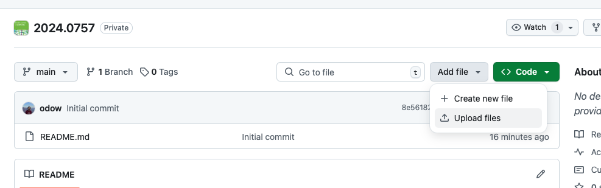

# Instructions for authors

This document details the procedure for managing an IJOC GitHub submission from
the perspective of an author.

If you have questions, please email the Associate Editor assigned to manage your
GitHub submission.

To follow this guide, you must have already:

 * received an email from an Associate Editor and provided your GitHub user name
 * received and accepted an invite to a private GitHub repository

 You must complete the steps in this guide before you submit the next revision
 of you paper.

## Repository Name

The name of the repository associated with your paper is an eight-digit number
of the form `XXXX.YYYY`. This number is derived from your manuscript ID in
manuscript central.

The Manuscript ID has the format like `JOC-XXXX-MM-OA-YYYY.RN`, where

 * `XXXX` is the year of submission
 * `MM` is the month of submission
 * `OA` means "original article" (it will be `SI` for special issues)
 * `YYYY` is a monotonic index of the papers received in the calendar year
 * `.RN` is optional, and means that the current submission is revision `N`.

You will need to use the number `XXXX.YYYY` in many places.

The URL of your repository will be https://github.com/INFORMSJoC/XXXX.YYYY

Because it is initially private, you must be signed into GitHub using the user
name provided to the Associated Editor in order to view and make changes to it.

## Permissions and forks

Note that you do not have write access to the INFORMSJoC account. Please create
a fork in your personal account and then push to that.

To create a fork, go to the website https://github.com/INFORMSJoC/XXXX.YYYY
and click the "Fork" button in the upper right part of the screen.


Choose your personal user name, and click "Create fork".


The next step depends on whether you are comfortable using git.

### If you know how to use git

First, clone the repo, making sure to clone your fork instead of the `INFORMSJoC`
account.
```bash
git clone https://github.com/YOUR_USER_NAME/XXXX.YYYY
```

```bash
git checkout -b initial-submission
```

Now, make your local changes. See the next section for instructions on what the
repository must and should contain.

Once you have everything complete, create a new commit and push it to GitHub:

```bash
git add .
git commit -m "Initial code for paper"
git push -u origin initial-submission
```

Then, go to https://github.com/INFORMSJoC/XXXX.YYYY and follow the pop-up
instructions to open a new pull request.

If you are asked to make changes in the GitHub review, make them locally, then
do:

```bash
git add .
git commit -m "Changes in response to review"
git push
```

Your PR will update automatically.

### If you do not know how to use git

If you do not know how to use git, you can upload files to GitHub using their
web interface.

First, create a local folder on your machine, and add the code and data
following the instructions in the next section.

When complete, go to https://github.com/INFORMSJoC/XXXX.YYYY and click the
"Add file" button in the upper right, then click "Upload files".



Drag and drop your local folder into the staging area, make the title "Initial
code for paper", and follow the instructions to open a pull request.


## Repository layout

This section describes the structure of the code repository that you should
prepare for submission.

Use the template repository https://github.com/INFORMSJoC/2019.0000, or look at
other repositories in https://github.com/INFORMSJoC.

There are three files in the root of the template repository that you must
include:

 * `README.md` must describe the contribution, how to use it, how to cite
   it, and how to replicate the experiments in the paper, following roughly
   the format of the template. Make sure to change:
    * All instances of `2019.0000` with `XXXX.YYYY`
    * The DOI for the code repo will be 10.1287/ijoc.XXXX.YYYY.cd
    * All references to `T. Ralphs` with the names of your authors
    * If your code is public somewhere else, replace references to `JoCTemplate`
      with your repository, otherwise delete the relevant sentences
   The `## Cite` section must be the first subheading, and it must be the same
   format as the template.

 * `LICENSE` must be a file containing the text of the license under which
   you intend to distribute the software and/or data. You must provide a
   license in order for the material to be used legally by others. An
   [Open Source license](https://opensource.org/licenses) is preferred, and the
   license should allow free academic use at a minimum. Recommended licenses
   include:
     * the [MIT License](https://opensource.org/licenses/MIT) for software
     * any of the various [Creative Commons licenses](https://creativecommons.org/licenses/)
       for other types of material.

 * `AUTHORS` is a file, standard in the open source world, that lists the
   authors of the contribution (usually just a list of names and e-mails). Each
   line is an author, with the form `Author Name <author@email.com>`.

The remainder of the code repository is up to you. We suggest that you organize
the code into the following subdirectories:

   * `src` should contain the source code for any software.

   * `data` should contain data files needed for experiments or used in the
     paper.

   * `scripts` should contain any scripts used to replicate the experiments in
     the paper or run other automated tests or experiments.

   * `docs` contains any additional documentation. Note that it is possible for
      the contents of `docs` to be a web site that will be hosted under the
      URL https://INFORMSJoC.github.io/NameofRepo. Please let us know if you
      are interested in activating that option.

   * `results` should containing any raw results from the paper, as well as
     any plots or figures.

You may wish to have an additional README.md in any of the subdirectories to
provide additional information.

### Things to check

 * If you are including source code that you did not write, ensure that you
   include the LICENSE file that came with the code. If no LICENSE file exists,
   please ask the Associate Editor for advice.
 * If you are including data sets that you did not create, provide a README.md
   file in the `/data` directory that describes where you obtained each file
   from and provide any available LICENSE files. If the data set was part of a
   journal publication, provide the citation that any future readers should use
   if they re-use that data.
 * Your code does not need to be reproducible, but you should make a best-faith
   effort. If you have a `requirements.txt` or a `Manifest.toml` file, include
   that so readers can see the exact version of your dependencies. If your code
   requires a `Makefile`, include that and describe any additional dependencies
   that are needed in order to compile.
 * If you wrote scripts to post-process the results into the tables and figures
   included in the paper, please include them.

## Legal stuff

Ensure that all files contain proper copyright and licensing statements and that
the copyright holders have been notified of the submission. The copyright holder
may or may not be you, depending on your employment contract and who funded the
work.

## Review process

As part of the review process, additional changes may be requested. Respond to
the Associate Editor by replying to the emails you receive from GitHub, or by
commenting on the Pull Request.

Note that you can edit the files in an existing pull request; you do not need to
create a new pull request to respond to a review.

## Archive and DOI

Once accepted by the editor, a snapshot of the contents of the repo will be
archived by creating a tag (known as a release on Github) with the name
`vXXXX.YYYY`, where the repo's name is `XXXX.YYYY`. This paper and the snapshot
of the repo will be given their own separate DOIs, also derived from the
manuscript number.

If the repo is named `XXXX.YYYY`, then the DOI for the paper will be

https://doi.org/10.1287/ijoc.XXXX.YYYY

and the DOI for the code repository will be

https://doi.org/10.1287/ijoc.XXXX.YYYY.cd

## Citing the repo in your paper

Once your code has been merged, a release tagged, and the repository made
public, the Associate Editor will send you an email asking you to submit a new
revision of the paper that cites the code repo.

The repo must be cited in your paper, as a regular reference, and appear in the
list of references as follows (if using BibTex). Notice that you must use both
the `doi` and the `note` lines to make this reference appear correctly.

```
@misc{AuthorYear,
  author =     {Put the authors' names here},
  publisher =  {INFORMS Journal on Computing},
  title =      {The title of your paper},
  year =       {The current year},
  doi =        {10.1287/ijoc.XXXX.YYYY.cd},
  note =       {Available for download at https://github.com/INFORMSJoC/XXXX.YYYY},
}
```

## FAQs

 * In the process of the review, changes were made to the software and/or
 data that was originally submitted and I don't want the original version of
 the software or data to be made public. Can you delete the history associated
 with the repository before making it public?

   * We can replace the repository used for the review process with a clean
     copy if you do not want the history made public.

 * What if I have an existing repository where the software is already being
   developed? Can I continue to develop there?

   * We expect this to sometimes be the case. But we still need to archive
     the version of the software and/or data associated with the
     paper itself in a static and permanent repository within the IJOC Github organization.
     If you wish us to Fork or move an existing repository into the IJOC
     organization as part of the submission process, that can be discussed.

 * What if I don't already have an existing repository, but I want to continue
   developing the software after the paper is published?

   * This is highly encouraged, but further development should take place a on
     a personally managed site on Github or one of the other similar sites.
     You should put a link to the site where you will manage the software in
     the long-term in the README.md in the IJOC repository to ensure people
     can find your development site.  You cannot continue development on the IJOC Github site.

 * What if I later find a bug in the software and I want to fix it?

   * Please contact the Area Editor and we will determine the best course of
     action.

 * If I come out with a new version of the software later on, can I add it to
   the existing repository within the IJOC organization?

   * At the current time this is not done.  The answer to this may evolve over time. Please contact us if/when this
     happens and we will make a determination.
