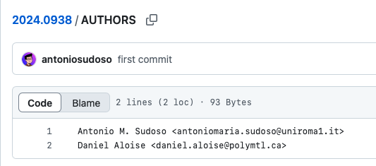
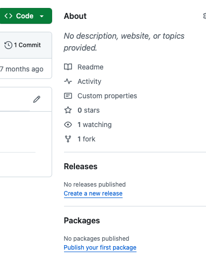
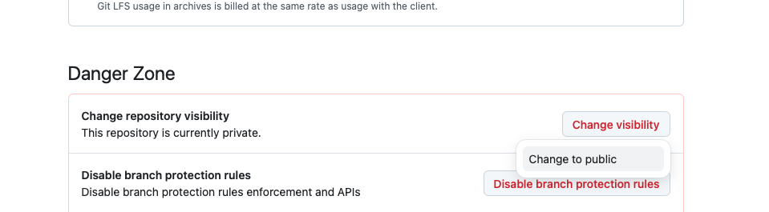

# Instructions for Editors

This document details the procedure for managing an IJOC GitHub submission from
the perspective of an Associate Editor.

To execute these instructions, you must have already created a Github
account and contacted Ted Ralphs to be added to the IJOC Area Editors group.

If questions, please contact Oscar: [o.dowson@gmail.com](mailto:o.dowson@gmail.com)

*The GitHub website sometimes changes the UI around. If the screenshots are out-of-date, please let `@odow` know and he will update them.*

## Step 0: get notified of a new paper and start tracking it

The Area Editor will send and email to the authors and cc in you. It will say
something like:

```
Dear Lead Author:

Manuscript ID JOC-2025-01-OA-1234.R2 entitled "A new paper" which you submitted
to INFORMS Journal on Computing, has been reviewed and acceptance has been
recommended.

However, I would first like to suggest some minor revisions to your manuscript:

Please work with the associate editor, Your Name, to make your exact problem
data and results available online at the IJOC GitHub site.
```

The Manuscript ID has the format `JOC-XXXX-MM-OA-YYYY.RN`, where

 * `XXXX` is the year of submission
 * `MM` is the month of submission
 * `OA` means "original article" (it will be `SI` for special issues)
 * `YYYY` is a monotonic index of the papers received in the calendar year
 * `.RN` is optional, and means that the current submission is revision `N`.

In reponse to this email:

 * Create a new issue in the repository-status-tracking: https://github.com/INFORMSJoC/repository-status-tracking/issues/new?template=new_issue.md
 * Change the title to the eight-digit number, `XXXX.YYYY`, which matches the manuscript ID.
 * Replace `XXXX.YYYY` in the link `https://github.com/INFORMSJoC/XXXX.YYYY` with the actual number.
   (This link does not exist yet, we will create shortly)
 * In the right-hand toolbar, click "Assign yourself".
 * Click "Create" at the bottom.

We will use this issue to privately track the progress of each paper and discuss
any questions that arise. When you have completed each step, update the tracking
issue.

## Step 1: get the user name from authors

Go back to the email from the Area Editor, hit reply-all, and send this email.

Replace:

* `v` by the lead author's name (one occurrence)
* `<<your name>>` by your name (one occurrence)

```
Dear <<Lead Author>>:

To get started with the process of uploading your code, you'll need a GitHub
account.

If you don't already have one, you can sign up for free at https://github.com.

Once you have an account, please let me know the user name (or names, if
multiple authors want to help) so that I can start the process of creating a
repository and adding you as an author.

After I have released the repository, you should then submit a final revision of
the paper that appropriately cites your code using the DOI I will provide.

Cheers,
<<your name>>
```

**Update the tracking issue: https://github.com/INFORMSJoC/repository-status-tracking/issues**

## Step 2: create a repository

When you receive a response from the author with the name of a GitHub account:

Go to [https://github.com/INFORMSJoC](https://github.com/INFORMSJoC)

Click the "new" button


Enter the eight-digit ID of the paper (`XXXX.YYYY`), click "Add a README" then "Create repository"


You’ll end up at


Click "Settings" then "Collaborators and teams"


You will be prompted to re-authenticate.

Click "Add people", type in the user name, then click on the person


Choose **Read** then click "Add selection"

**Why we chose Read: choosing Read means that the author does not have
permission to merge their own pull requests, or to make changes to the
repository after the paper has been accepted without going through a PR and
review by someone at IJOC. We want the code repository to be a snapshot of the
code at the time the paper is written. We don’t want on-going changes. The
downside to "Read" is that authors must fork the repo to add code. More on this
later.**


If all well, you should see


**Update the tracking issue: https://github.com/INFORMSJoC/repository-status-tracking/issues**

## Step 3: tell the authors to make a PR

Once the GitHub repository is setup, go back the email, hit reply-all, end them this email.
Ensure that the recipients includes all the original participants. (Sometimes authors will
remove some participants like the Area Editor.)

Replace:

* `<<GitHub ID>>` by the GitHub names you added (one occurrence)
* `<<paper id>>` by the ID of the paper (four occurrences)
* `<<your name>>` by your name (one occurrence)

```
Hi all,

I've created the repository and sent an invite to <<GitHub ID>>
to join as a collaborator.

The URL is https://github.com/INFORMSJoC/<<paper id>> (currently private, so only
the accounts that I've added can see it).

Next steps:

Please make a pull request to add your code to the
https://github.com/INFORMSJoC/<<paper id>>
repository.

Note that you do not have write access to the INFORMSJoC account. Please create
a fork in your personal account and then push to that.

You should use the following template repository as a guide (or look at other
repositories in https://github.com/INFORMSJoC):

https://github.com/INFORMSJoC/2019.0000

There are three files in the root of the template repository that you must
include:

* README: Use this as a guide, making sure to change:
  * All instances of `2019.0000` with `<<paper id>>`
  * The DOI for the code repo will be 10.1287/ijoc.<<paper id>>.cd
  * All references to `T. Ralphs` with the names of your authors
  * If your code is public somewhere else, replace references to `JoCTemplate`
    with your repository, otherwise delete the relevant sentences
* AUTHORS: Please update the AUTHORS file with appropriate contact information
* LICENSE: Please add an appropriate LICENSE file. If you aren't sure which,
  the most common choice is MIT. Copy the file from https://github.com/INFORMSJoC/2019.0000/blob/master/LICENSE
  replacing the year and `Ted Ralphs` with the current year and the names of
  your authors.

You can find more instructions here:

https://github.com/INFORMSJoC/INFORMSJoC.github.io/blob/master/InstructionsForAuthors.md

Once you've opened the pull request, I'll review it and we can make any
necessary changes, so don't worry too much about getting things perfect before
opening a pull request.

Please note that you must complete the GitHub process before you submit a
revision of the paper.

Let me know if you need any help with the steps above, or if you have any other
questions.

Regards,
<<your name>>
```

**Update the tracking issue: https://github.com/INFORMSJoC/repository-status-tracking/issues**

## Step 4: review the PR

This can be a little subjective. We’re not asking for perfect code that is we
documented and reproducible. We want, at minimum, the authors to make an effort
to provide some evidence that they have in fact conducted some numerical
experiments to justify publication in IJOC. (But I have had one paper that did
not involve any computer code or artifacts…)

My hope is that in time, the gentle nudge from IJOC will encourage people to
improve their research practices if they know that they will need to make the
final artifact public.

### Review the README

Check that the README includes the IJOC image header. The first sentence links
to IJOC and an appropriate license. Check all links\! People get these wrong
pretty frequently. If they have code somewhere else, it links to that. Here is
an example:


Check that the first section of the README is the "Cite" section with accurate
bibtex. Here’s a good example. Double check: the DOI ends in .cd, and both the
"url" and "note" fields exist. Also double check that the "author" includes all
authors on the paper. If not, double check with the author whether other people
contributed to the code, and suggest that they may want to name all authors,
even if they were the only one that contributed to the code…


Read the rest of the README. Make subjective comments.

### Review the LICENSE

Double check that the link in the README links to the LICENSE.

Check that the LICENSE file is a valid open-source license (tag `@odow` in a
comment if unsure).

Check that the year and authors are correct, and that "Ted Ralphs" is not
mentioned.

It should look something like this:


### Review AUTHORS

Check that the format is "Name <email>" with one entry per line



### Review third-party contributions

1. If people have included code/input data/MPS files/etc that was not written by them, double check where the authors obtained these from. If from someone’s website, ask if they have permission form the original author to redistribute. If from a different GitHub site, check if the GitHub site includes a LICENSE that allows redistribution, and get the author to include that LICENSE in the relevant folder. Make sure that they explicitly document in the README etc that the code/data is not theirs and where they got it from.
2. If redistribution is not allowed, get them to delete the code/data and provide instructions for how future readers can obtain their own copy.
3. If in doubt, ping @odow in a comment

### Review the rest of the code

This is very subjective. Make a best effort. You don’t need to run it. If it
looks okay, it’s okay. If there are glaring errors, ask for clarifications. The
main things to watch out for are things like this (all true stories):

1. The code doesn’t appear to have been written by them, for example, it is
   copy-pasted from somewhere else and includes HTML tags because they have just
   done CTRL+A / CTRL+C / CTRL+V to dump a bunch of code from GitHub into a file

2. They mention that code was used to generate input data/examples/tests but no
   source code is provided

3. They don’t appear to have read or understand their own instructions in the
   README. For example, The code is in Julia, but the README says install python
   and do "pip install JuMP".

It’s okay if some of the code is omitted if it relies on closed-source code. But
make sure that they appropriately document this in the README. For example:


**Update the tracking issue: https://github.com/INFORMSJoC/repository-status-tracking/issues**

## Step 5: merge the PR

At the bottom, click the down arrow next to "Merge pull request" and change to
"Squash and merge"


Click squash and merge, then change the "Commit message" to "Add initial code
for paper" and delete the "Extended description"


Click "Confirm squash and merge"

**Update the tracking issue: https://github.com/INFORMSJoC/repository-status-tracking/issues**

## Step 6: create a release

Go to the homepage of the repo, and, on the right, click "Create a new release"


Click "Choose a tag" and make it "vXXXX.YYYY" matching the ID of the paper. Click "Create new tag"


Click "Generate release notes" then rename the title to

"Archived version of code for IJOC paper https://doi.org/10.1287/ijoc.XXXX.YYYY"


Click "Publish release" at the bottom

**Update the tracking issue: https://github.com/INFORMSJoC/repository-status-tracking/issues**

## Step 7: make the repository public

Go back to the settings page, scroll to the bottom to "Danger Zone" click "Change visibility" and then "Change to public"



Accept the consequences.

**Update the tracking issue: https://github.com/INFORMSJoC/repository-status-tracking/issues**

## Step 8: tell the authors

Send them this email. Replace:

* `<<paper id>>` by the ID of the paper (two occurrences)
* `<<your name>>` by your name (one occurence)

```
Dear all,

I have published the repo: https://github.com/INFORMSJoC/<<paper id>>

You should now submit a revision of the paper that cites the GitHub repository using the BibTeX at
https://github.com/INFORMSJoC/<<paper id>>?tab=readme-ov-file\#cite

Regards,
<<your name>>
```

**Update the tracking issue: https://github.com/INFORMSJoC/repository-status-tracking/issues**

## Step 9: close the tracking issue

You're all done!

**Close the tracking issue: https://github.com/INFORMSJoC/repository-status-tracking/issues**
